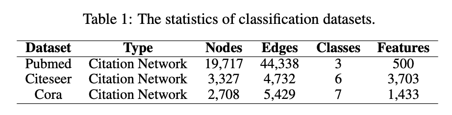

# Semantic Graph Convolutional Networks

This repository is the official implementation of Semantic Graph Convolutional Networks.

The ML Code Completeness Checklist consists of three items:

1. **Specification of dependencies**
2. **Code**
3. **Data**

We explain each item on the checklist in detail blow. 

### 1. Specification of dependencies

If you are using Python, we provid you with a `requirements.txt` file.

You can choose 'pip' or 'conda' command to install all dependencies in `requirements.txt`. We suggest you create a new virtual environment to try our code.

#### Hardware environment:
In our experiments, we trained our model via 8 32G NVIDIA Tesla V100 GPUs and 64 Intel(R) Xeon(R) Gold 5218 CPU @ 2.30GHz. 

### 2. Code

At present, we provide the code file `SGCN.py` which includes the training module and the evaluation module. We will sort out our code more systematically in future.

Due to the capacity limitations, we give the code and dataset  of major experiment 'Semi-Supervised Node Classification' on Cora, Citeseer and Pubmed in. In the experiment, we would utilize hyperopt to optimize the parameters in the search space and tune the neighbors slightly to get robust averaged results. 

We list some runing samples in `/notebook/result.ipynb`.  It is easily to train and eval the model as:

1) Cora
````
CUDA_VISIBLE_DEVICES=0 python SGCN.py @parameter_cora*
````

2) Pubmed
````
CUDA_VISIBLE_DEVICES=1 python SGCN.py @parameter_pubmed*
````

3) Citeseer

The highest accuracy on Citeseer is given by SGCN-path.py, we give the sample of SGCN-path.py:
````
CUDA_VISIBLE_DEVICES=2 python SGCN-path.py @parameter_citeseer*
````
Note that `parameter*` is corresponding parameter file. And we list these results in `/notebook/result.ipynb`, we suggest you open it by jupyter notebook.

### 3. Data

The dataset of Cora, Citeseer and Pubmed are given in /notebooks/data/. We show the details in Table 1.



I hope our document can help you to understand what we do！
